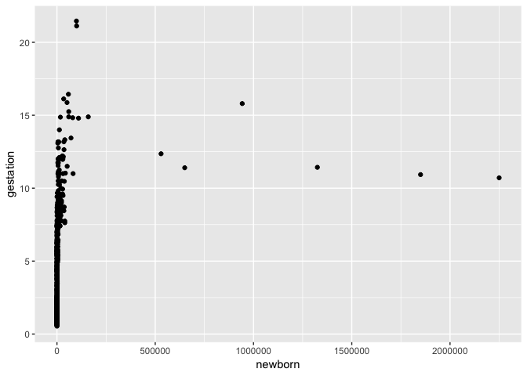

## Instructions
Answer the following questions and complete the exercises in RMarkdown. Please embed all of your code, keep track of your versions using git, and push your final work to our [GitHub repository](https://github.com/FRS417-DataScienceBiologists). I will randomly select a few examples of student work at the start of each session to use as examples so be sure that your code is working to the best of your ability.

## Load the tidyverse

```r
library(tidyverse)
```

```
## ── Attaching packages ─────────────────────────────────────── tidyverse 1.2.1 ──
```

```
## ✔ ggplot2 3.1.0     ✔ purrr   0.2.5
## ✔ tibble  2.0.0     ✔ dplyr   0.7.8
## ✔ tidyr   0.8.2     ✔ stringr 1.3.1
## ✔ readr   1.3.1     ✔ forcats 0.3.0
```

```
## ── Conflicts ────────────────────────────────────────── tidyverse_conflicts() ──
## ✖ dplyr::filter() masks stats::filter()
## ✖ dplyr::lag()    masks stats::lag()
```
## Mammals Life History
Let's revisit the mammal life history data to practice our `ggplot` skills. Some of the tidy steps will be a repeat from the homework, but it is good practice. The [data](http://esapubs.org/archive/ecol/E084/093/) are from: *S. K. Morgan Ernest. 2003. Life history characteristics of placental non-volant mammals. Ecology 84:3402.*

1. Load the data.

```r
life_history <- readr::read_csv("mammal_lifehistories_v2.csv")
```

```
## Parsed with column specification:
## cols(
##   order = col_character(),
##   family = col_character(),
##   Genus = col_character(),
##   species = col_character(),
##   mass = col_double(),
##   gestation = col_double(),
##   newborn = col_double(),
##   weaning = col_double(),
##   `wean mass` = col_double(),
##   AFR = col_double(),
##   `max. life` = col_double(),
##   `litter size` = col_double(),
##   `litters/year` = col_double()
## )
```

2. Use your preferred function to have a look. Do you notice any problems?

```r
glimpse(life_history)
```

```
## Observations: 1,440
## Variables: 13
## $ order          <chr> "Artiodactyla", "Artiodactyla", "Artiodactyla", "…
## $ family         <chr> "Antilocapridae", "Bovidae", "Bovidae", "Bovidae"…
## $ Genus          <chr> "Antilocapra", "Addax", "Aepyceros", "Alcelaphus"…
## $ species        <chr> "americana", "nasomaculatus", "melampus", "busela…
## $ mass           <dbl> 45375.0, 182375.0, 41480.0, 150000.0, 28500.0, 55…
## $ gestation      <dbl> 8.13, 9.39, 6.35, 7.90, 6.80, 5.08, 5.72, 5.50, 8…
## $ newborn        <dbl> 3246.36, 5480.00, 5093.00, 10166.67, -999.00, 381…
## $ weaning        <dbl> 3.00, 6.50, 5.63, 6.50, -999.00, 4.00, 4.04, 2.13…
## $ `wean mass`    <dbl> 8900, -999, 15900, -999, -999, -999, -999, -999, …
## $ AFR            <dbl> 13.53, 27.27, 16.66, 23.02, -999.00, 14.89, 10.23…
## $ `max. life`    <dbl> 142, 308, 213, 240, -999, 251, 228, 255, 300, 324…
## $ `litter size`  <dbl> 1.85, 1.00, 1.00, 1.00, 1.00, 1.37, 1.00, 1.00, 1…
## $ `litters/year` <dbl> 1.00, 0.99, 0.95, -999.00, -999.00, 2.00, -999.00…
```
##There are a lot of "-999" which should be NA's.


3. There are NA's. How are you going to deal with them?

```r
life_history <- 
  life_history %>% 
  na_if(-999)
glimpse(life_history)
```

```
## Observations: 1,440
## Variables: 13
## $ order          <chr> "Artiodactyla", "Artiodactyla", "Artiodactyla", "…
## $ family         <chr> "Antilocapridae", "Bovidae", "Bovidae", "Bovidae"…
## $ Genus          <chr> "Antilocapra", "Addax", "Aepyceros", "Alcelaphus"…
## $ species        <chr> "americana", "nasomaculatus", "melampus", "busela…
## $ mass           <dbl> 45375.0, 182375.0, 41480.0, 150000.0, 28500.0, 55…
## $ gestation      <dbl> 8.13, 9.39, 6.35, 7.90, 6.80, 5.08, 5.72, 5.50, 8…
## $ newborn        <dbl> 3246.36, 5480.00, 5093.00, 10166.67, NA, 3810.00,…
## $ weaning        <dbl> 3.00, 6.50, 5.63, 6.50, NA, 4.00, 4.04, 2.13, 10.…
## $ `wean mass`    <dbl> 8900, NA, 15900, NA, NA, NA, NA, NA, 157500, NA, …
## $ AFR            <dbl> 13.53, 27.27, 16.66, 23.02, NA, 14.89, 10.23, 20.…
## $ `max. life`    <dbl> 142, 308, 213, 240, NA, 251, 228, 255, 300, 324, …
## $ `litter size`  <dbl> 1.85, 1.00, 1.00, 1.00, 1.00, 1.37, 1.00, 1.00, 1…
## $ `litters/year` <dbl> 1.00, 0.99, 0.95, NA, NA, 2.00, NA, 1.89, 1.00, 1…
```
##Make R identify the "-999" as an NA.

4. Where are the NA's? This is important to keep in mind as you build plots.

```r
life_history %>% 
  purrr::map_df(~ sum(is.na(.))) %>% 
  tidyr::gather(variables, num_nas) %>% 
  arrange(desc(num_nas))
```

```
## # A tibble: 13 x 2
##    variables    num_nas
##    <chr>          <int>
##  1 wean mass       1039
##  2 max. life        841
##  3 litters/year     689
##  4 weaning          619
##  5 AFR              607
##  6 newborn          595
##  7 gestation        418
##  8 mass              85
##  9 litter size       84
## 10 order              0
## 11 family             0
## 12 Genus              0
## 13 species            0
```
##Identifying where NA's occur and arranging variables from greatest to least number of NA's present.

5. Some of the variable names will be problematic. Let's rename them here as a final tidy step.

```r
life_history <- 
  life_history %>% 
  dplyr::rename(genus = Genus, litter_size = `litter size`, max_life = `max. life`, wean_mass = `wean mass`, litters_year = `litters/year`)
```


```r
glimpse(life_history)
```

```
## Observations: 1,440
## Variables: 13
## $ order        <chr> "Artiodactyla", "Artiodactyla", "Artiodactyla", "Ar…
## $ family       <chr> "Antilocapridae", "Bovidae", "Bovidae", "Bovidae", …
## $ genus        <chr> "Antilocapra", "Addax", "Aepyceros", "Alcelaphus", …
## $ species      <chr> "americana", "nasomaculatus", "melampus", "buselaph…
## $ mass         <dbl> 45375.0, 182375.0, 41480.0, 150000.0, 28500.0, 5550…
## $ gestation    <dbl> 8.13, 9.39, 6.35, 7.90, 6.80, 5.08, 5.72, 5.50, 8.9…
## $ newborn      <dbl> 3246.36, 5480.00, 5093.00, 10166.67, NA, 3810.00, 3…
## $ weaning      <dbl> 3.00, 6.50, 5.63, 6.50, NA, 4.00, 4.04, 2.13, 10.71…
## $ wean_mass    <dbl> 8900, NA, 15900, NA, NA, NA, NA, NA, 157500, NA, NA…
## $ AFR          <dbl> 13.53, 27.27, 16.66, 23.02, NA, 14.89, 10.23, 20.13…
## $ max_life     <dbl> 142, 308, 213, 240, NA, 251, 228, 255, 300, 324, 30…
## $ litter_size  <dbl> 1.85, 1.00, 1.00, 1.00, 1.00, 1.37, 1.00, 1.00, 1.0…
## $ litters_year <dbl> 1.00, 0.99, 0.95, NA, NA, 2.00, NA, 1.89, 1.00, 1.0…
```
##Renaming variable.

##`ggplot()`
For the questions below, try to use the aesthetics you have learned to make visually appealing and informative plots. Make sure to include labels for the axes and titles.

6. What is the relationship between newborn body mass and gestation? Make a scatterplot that shows this relationship. 

```r
options(scipen=999)
```


```r
life_history %>% 
  ggplot(aes(newborn, gestation)) + 
  geom_point()
```

```
## Warning: Removed 673 rows containing missing values (geom_point).
```

<!-- -->


7. You should notice that because of the outliers in newborn mass, we need to make some changes. We didn't talk about this in lab, but you can use `scale_x_log10()` as a layer to correct for this issue. This will log transform the y-axis values.

```r
life_history %>% 
  ggplot(aes(newborn, gestation)) +
  geom_point() +
  scale_x_log10()+
  labs(title = "Gestation Time vs Newborn Mass", "Newborn Mass (g)", "Gestation (months)")
```

```
## Warning: Removed 673 rows containing missing values (geom_point).
```

<!-- -->
##Voila, a scatterplot!

8. Now that you have the basic plot, color the points by taxonomic order.

```r
life_history %>% 
  ggplot(aes(newborn, gestation, color = order)) +
  geom_point() +
  scale_x_log10()+
  labs(title = "Gestation Time vs Newborn Mass", "Newborn Mass (g)", "Gestation (months)")
```

```
## Warning: Removed 673 rows containing missing values (geom_point).
```

<!-- -->


9. Lastly, make the size of the points proportional to body mass.

```r
life_history %>% 
  ggplot(aes(newborn, gestation, color = order, size = mass)) +
  geom_point() +
  scale_x_log10() +
  labs(title = "Gestation Time vs Newborn Mass", "Newborn Mass (g)", "Gestation (months)", color = "Taxanomic Order") +
  scale_size(guide = "none")
```

```
## Warning: Removed 691 rows containing missing values (geom_point).
```

<!-- -->
##Added some color to each order and relatice size to each dot.

10. Make a plot that shows the range of lifespan by order.

```r
life_history %>% 
  ggplot(aes(order, max_life, fill = order)) +
  geom_boxplot() +
  coord_flip() +
  scale_y_log10() +
  labs(title = "Lifespan for each Taxanomic Order", x = "Taxanomic Order", y = "Lifespan (months)", fill = "Taxanomic Order")
```

```
## Warning: Removed 841 rows containing non-finite values (stat_boxplot).
```

<!-- -->
##Now that's some saucy stuff!
