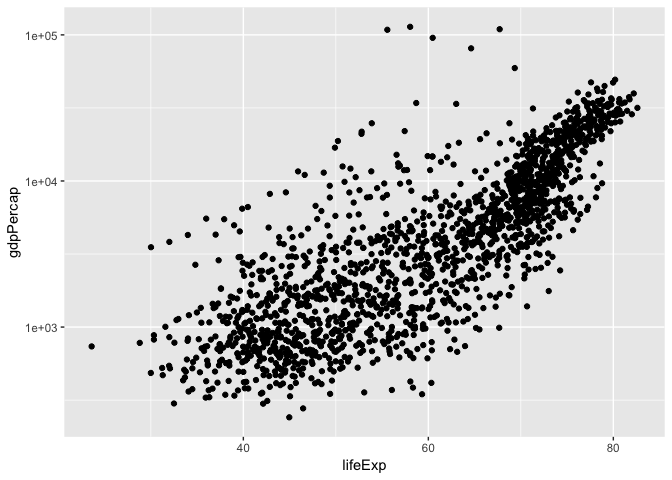
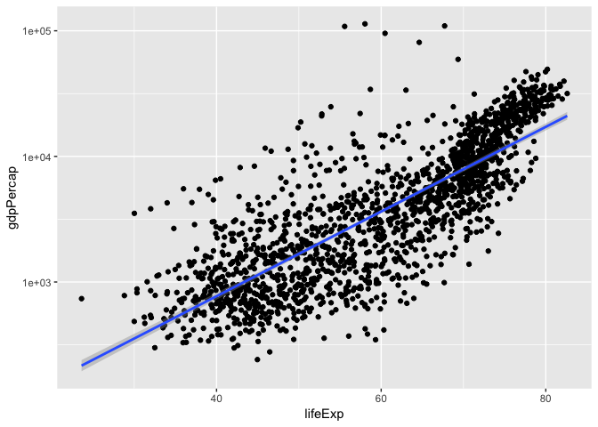
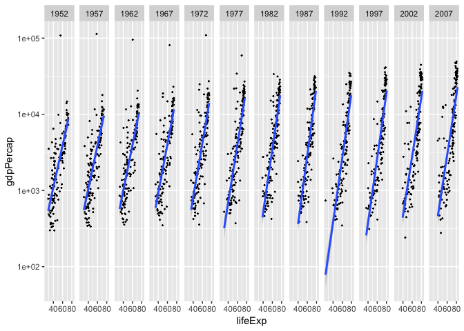
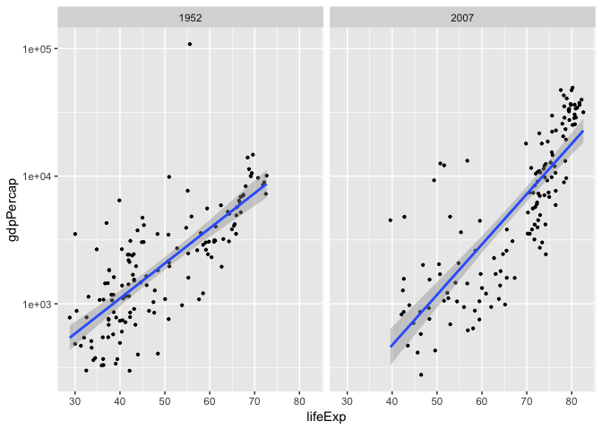
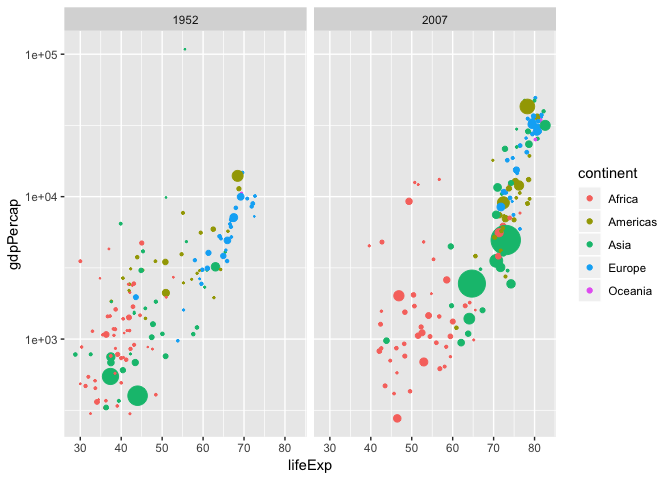
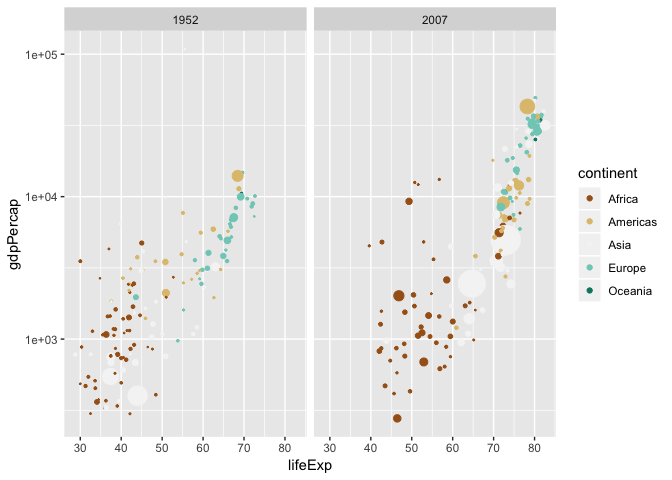

```r
library(tidyverse)
```

```
## ── Attaching packages ────────────────────────────────────────────────────────────────────────────────────────────────────────── tidyverse 1.2.1 ──
```

```
## ✔ ggplot2 3.1.0       ✔ purrr   0.3.1  
## ✔ tibble  2.0.1       ✔ dplyr   0.8.0.1
## ✔ tidyr   0.8.3       ✔ stringr 1.4.0  
## ✔ readr   1.3.1       ✔ forcats 0.4.0
```

```
## ── Conflicts ───────────────────────────────────────────────────────────────────────────────────────────────────────────── tidyverse_conflicts() ──
## ✖ dplyr::filter() masks stats::filter()
## ✖ dplyr::lag()    masks stats::lag()
```


```r
library(skimr)
```

```
## 
## Attaching package: 'skimr'
```

```
## The following object is masked from 'package:stats':
## 
##     filter
```


```r
library("RColorBrewer")
```


```r
library(gapminder)
```


```r
gapminder <-
  gapminder::gapminder
```

1. Explore the data using the various function you have learned. Is it tidy, are there any NA’s, what are its dimensions, what are the column names, etc.

```r
gapminder
```

```
## # A tibble: 1,704 x 6
##    country     continent  year lifeExp      pop gdpPercap
##    <fct>       <fct>     <int>   <dbl>    <int>     <dbl>
##  1 Afghanistan Asia       1952    28.8  8425333      779.
##  2 Afghanistan Asia       1957    30.3  9240934      821.
##  3 Afghanistan Asia       1962    32.0 10267083      853.
##  4 Afghanistan Asia       1967    34.0 11537966      836.
##  5 Afghanistan Asia       1972    36.1 13079460      740.
##  6 Afghanistan Asia       1977    38.4 14880372      786.
##  7 Afghanistan Asia       1982    39.9 12881816      978.
##  8 Afghanistan Asia       1987    40.8 13867957      852.
##  9 Afghanistan Asia       1992    41.7 16317921      649.
## 10 Afghanistan Asia       1997    41.8 22227415      635.
## # … with 1,694 more rows
```
##Data is Tidy.

```r
glimpse(gapminder)
```

```
## Observations: 1,704
## Variables: 6
## $ country   <fct> Afghanistan, Afghanistan, Afghanistan, Afghanistan, Af…
## $ continent <fct> Asia, Asia, Asia, Asia, Asia, Asia, Asia, Asia, Asia, …
## $ year      <int> 1952, 1957, 1962, 1967, 1972, 1977, 1982, 1987, 1992, …
## $ lifeExp   <dbl> 28.801, 30.332, 31.997, 34.020, 36.088, 38.438, 39.854…
## $ pop       <int> 8425333, 9240934, 10267083, 11537966, 13079460, 148803…
## $ gdpPercap <dbl> 779.4453, 820.8530, 853.1007, 836.1971, 739.9811, 786.…
```


```r
gapminder %>% 
  skimr::skim()
```

```
## Skim summary statistics
##  n obs: 1704 
##  n variables: 6 
## 
## ── Variable type:factor ───────────────────────────────────────────────────────────────────────────────────────────────────────────────────────────
##   variable missing complete    n n_unique
##  continent       0     1704 1704        5
##    country       0     1704 1704      142
##                              top_counts ordered
##  Afr: 624, Asi: 396, Eur: 360, Ame: 300   FALSE
##      Afg: 12, Alb: 12, Alg: 12, Ang: 12   FALSE
## 
## ── Variable type:integer ──────────────────────────────────────────────────────────────────────────────────────────────────────────────────────────
##  variable missing complete    n    mean       sd    p0        p25     p50
##       pop       0     1704 1704 3e+07    1.1e+08 60011 2793664    7e+06  
##      year       0     1704 1704  1979.5 17.27     1952    1965.75  1979.5
##       p75       p100     hist
##  2e+07       1.3e+09 ▇▁▁▁▁▁▁▁
##   1993.25 2007       ▇▃▇▃▃▇▃▇
## 
## ── Variable type:numeric ──────────────────────────────────────────────────────────────────────────────────────────────────────────────────────────
##   variable missing complete    n    mean      sd     p0     p25     p50
##  gdpPercap       0     1704 1704 7215.33 9857.45 241.17 1202.06 3531.85
##    lifeExp       0     1704 1704   59.47   12.92  23.6    48.2    60.71
##      p75      p100     hist
##  9325.46 113523.13 ▇▁▁▁▁▁▁▁
##    70.85     82.6  ▁▂▅▅▅▅▇▃
```


```r
gapminder %>% 
  summarize(number_nas= sum(is.na(gapminder)))
```

```
## # A tibble: 1 x 1
##   number_nas
##        <int>
## 1          0
```
##No NA's.

```r
colnames(gapminder)
```

```
## [1] "country"   "continent" "year"      "lifeExp"   "pop"       "gdpPercap"
```

2. We are interested in the relationship between per capita GDP and life expectancy; i.e. does having more money help you live longer on average. Make a quick plot below to visualize this relationship.

```r
gapminder %>% 
  ggplot(aes(lifeExp, gdpPercap)) +
  geom_point() +
  scale_y_log10()
```

<!-- -->
##More money equals longer life expectancy.
3. There is extreme disparity in per capita GDP. Rescale the x axis to make this easier to interpret. How would you characterize the relationship?

```r
gapminder %>% 
  ggplot(aes(lifeExp, gdpPercap)) +
  geom_point() +
  scale_y_log10() +
  geom_smooth(method = lm, se = TRUE)
```

<!-- -->
##There is a strong positive relationship between GDP per capita and life expextancy.

4. This should look pretty dense to you with significant overplotting. Try using a faceting approach to break this relationship down by year.

```r
gapminder %>% 
  ggplot(aes(lifeExp, gdpPercap)) +
  geom_point(size = 0.3) +
  scale_y_log10() +
  geom_smooth(method = lm, se = TRUE) +
  facet_grid(~year)
```

<!-- -->


5. Simplify the comparison by comparing only 1952 and 2007. Can you come to any conclusions?

```r
gapminder %>% 
  filter(year==1952 | year==2007) %>% 
  ggplot(aes(lifeExp, gdpPercap)) +
  geom_point(size = 0.8) +
  scale_y_log10() +
  geom_smooth(method = lm, se = TRUE) +
  facet_grid(~year)
```

<!-- -->

6. Let’s stick with the 1952 and 2007 comparison but make some aesthetic adjustments. First try to color by continent and adjust the size of the points by population. Add + scale_size(range = c(0.1, 10), guide = "none") as a layer to clean things up a bit.

```r
gapminder %>% 
  filter(year==1952 | year==2007) %>% 
  ggplot(aes(lifeExp, gdpPercap, color = continent, size = pop)) +
  geom_point() +
  scale_y_log10() +
  facet_grid(~year) +
  scale_size(range = c(0.1, 10), guide = "none")
```

<!-- -->

7. Although we did not introduce them in lab, ggplot has a number of built-in themes that make things easier. I like the light theme for these data, but you can see lots of options. Apply one of these to your plot above.

```r
library("RColorBrewer")
```


```r
gapminder %>% 
  filter(year==1952 | year==2007) %>% 
  ggplot(aes(lifeExp, gdpPercap, color = continent, size = pop)) +
  geom_point() +
  scale_y_log10() +
  facet_grid(~year) +
  scale_size(range = c(0.1, 10), guide = "none") +
  scale_colour_brewer(palette = "BrBG")
```

<!-- -->


