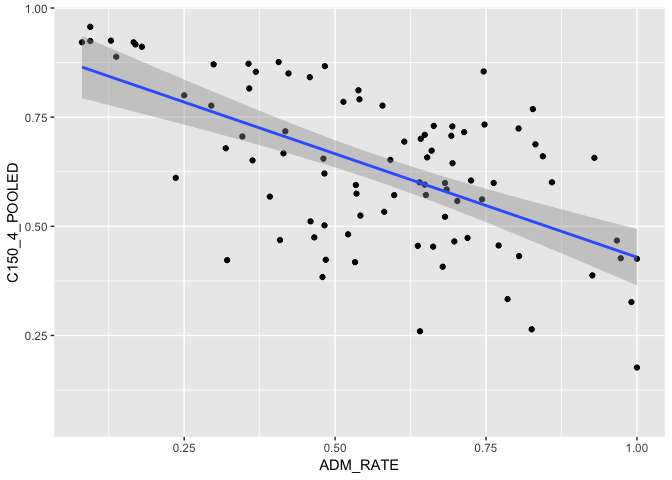

## Instructions
This exam is designed to show me what you have learned and where there are problems. You may use your notes and anything from the `class_files` folder, but please no internet searches. You have 35 minutes to complete as many of these exercises as possible on your own, and 10 minutes to work with a partner.  

At the end of the exam, upload the complete .Rmd file to your GitHub repository.  

1. Load the tidyverse.

```r
library(tidyverse)
```

```
## ── Attaching packages ─────────────────────────────────────── tidyverse 1.2.1 ──
```

```
## ✔ ggplot2 3.1.0     ✔ purrr   0.2.5
## ✔ tibble  2.0.0     ✔ dplyr   0.7.8
## ✔ tidyr   0.8.2     ✔ stringr 1.3.1
## ✔ readr   1.3.1     ✔ forcats 0.3.0
```

```
## ── Conflicts ────────────────────────────────────────── tidyverse_conflicts() ──
## ✖ dplyr::filter() masks stats::filter()
## ✖ dplyr::lag()    masks stats::lag()
```

2. For these questions, we will use data about California colleges. Load the `ca_college_data.csv` as a new object called `colleges`.

```r
colleges <-
  readr::read_csv("ca_college_data.csv", na = c(""," ", "NA","#N/A", "-999"))
```

```
## Parsed with column specification:
## cols(
##   INSTNM = col_character(),
##   CITY = col_character(),
##   STABBR = col_character(),
##   ZIP = col_character(),
##   ADM_RATE = col_double(),
##   SAT_AVG = col_double(),
##   PCIP26 = col_double(),
##   COSTT4_A = col_double(),
##   C150_4_POOLED = col_double(),
##   PFTFTUG1_EF = col_double()
## )
```


3. Use your preferred function to have a look at the data and get an idea of its structure.

```r
glimpse(colleges)
```

```
## Observations: 341
## Variables: 10
## $ INSTNM        <chr> "Grossmont College", "College of the Sequoias", "C…
## $ CITY          <chr> "El Cajon", "Visalia", "San Mateo", "Ventura", "Ox…
## $ STABBR        <chr> "CA", "CA", "CA", "CA", "CA", "CA", "CA", "CA", "C…
## $ ZIP           <chr> "92020-1799", "93277-2214", "94402-3784", "93003-3…
## $ ADM_RATE      <dbl> NA, NA, NA, NA, NA, NA, NA, NA, NA, NA, NA, NA, NA…
## $ SAT_AVG       <dbl> NA, NA, NA, NA, NA, NA, NA, NA, NA, NA, NA, NA, NA…
## $ PCIP26        <dbl> 0.0016, 0.0066, 0.0038, 0.0035, 0.0085, 0.0151, 0.…
## $ COSTT4_A      <dbl> 7956, 8109, 8278, 8407, 8516, 8577, 8580, 9181, 92…
## $ C150_4_POOLED <dbl> NA, NA, NA, NA, NA, NA, 0.2334, NA, NA, NA, NA, 0.…
## $ PFTFTUG1_EF   <dbl> 0.3546, 0.5413, 0.3567, 0.3824, 0.2753, 0.4286, 0.…
```


4. What are the column names?

```r
names(colleges)
```

```
##  [1] "INSTNM"        "CITY"          "STABBR"        "ZIP"          
##  [5] "ADM_RATE"      "SAT_AVG"       "PCIP26"        "COSTT4_A"     
##  [9] "C150_4_POOLED" "PFTFTUG1_EF"
```


5. Are there any NA's in the data? If so, how many are present and in which variables?

```r
colleges %>% 
  summarize(number_nas= sum(is.na(colleges)))
```

```
## # A tibble: 1 x 1
##   number_nas
##        <int>
## 1        949
```


```r
colleges %>% 
  purrr::map_df(~ sum(is.na(.)))
```

```
## # A tibble: 1 x 10
##   INSTNM  CITY STABBR   ZIP ADM_RATE SAT_AVG PCIP26 COSTT4_A C150_4_POOLED
##    <int> <int>  <int> <int>    <int>   <int>  <int>    <int>         <int>
## 1      0     0      0     0      240     276     35      124           221
## # … with 1 more variable: PFTFTUG1_EF <int>
```


6. Which cities in California have the highest number of colleges?

```r
colleges %>% 
  group_by(CITY) %>% 
  summarise(total=n())
```

```
## # A tibble: 161 x 2
##    CITY        total
##    <chr>       <int>
##  1 Alameda         3
##  2 Anaheim         4
##  3 Angwin          1
##  4 Aptos           1
##  5 Arcata          1
##  6 Atherton        1
##  7 Azusa           1
##  8 Bakersfield     3
##  9 Barstow         1
## 10 Belmont         1
## # … with 151 more rows
```


7. The column `COSTT4_A` is the annual cost of each institution. Which city has the highest cost?

```r
colleges %>%
  select(CITY, COSTT4_A) %>% 
  arrange(desc(COSTT4_A))
```

```
## # A tibble: 341 x 2
##    CITY          COSTT4_A
##    <chr>            <dbl>
##  1 Claremont        69355
##  2 Los Angeles      67225
##  3 Los Angeles      67064
##  4 Los Angeles      67046
##  5 Claremont        66325
##  6 Malibu           66152
##  7 Claremont        66060
##  8 Claremont        65880
##  9 San Francisco    65453
## 10 Claremont        64870
## # … with 331 more rows
```


8. The column `ADM_RATE` is the admissions rate by college and `C150_4_POOLED` is the four-year completion rate. Use a scatterplot to show the relationship between these two variables. What does this mean?

```r
colleges %>% 
  ggplot(aes(x = C150_4_POOLED, y = ADM_RATE)) +
  geom_jitter()
```

```
## Warning: Removed 251 rows containing missing values (geom_point).
```

<!-- -->


9. The column titled `INSTNM` is the institution name. We are only interested in the University of California colleges. Run the code below and look at the output. Are all of the columns tidy? Why or why not?

```r
  colleges %>% 
  filter_all(any_vars(str_detect(.,pattern = "University of Califronia")))
```

```
## # A tibble: 0 x 10
## # … with 10 variables: INSTNM <chr>, CITY <chr>, STABBR <chr>, ZIP <chr>,
## #   ADM_RATE <dbl>, SAT_AVG <dbl>, PCIP26 <dbl>, COSTT4_A <dbl>,
## #   C150_4_POOLED <dbl>, PFTFTUG1_EF <dbl>
```


10. Use `separate()` to separate institution name into two new columns "UNIV" and "CAMPUS".


11. As a final step, remove `Hastings College of Law` and `UC San Francisco` and store the final data frame as a new object `univ_calif_final`.


12. The column `ADM_RATE` is the admissions rate by campus. Which UC has the lowest and highest admissions rates? Please use a barplot.


## Knit Your Output and Post to [GitHub](https://github.com/FRS417-DataScienceBiologists)
